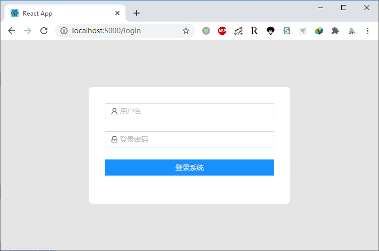
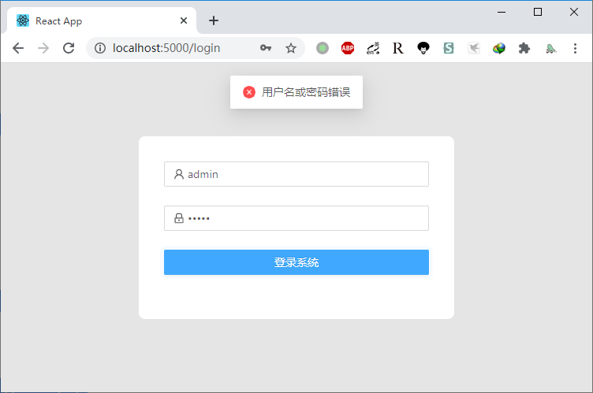
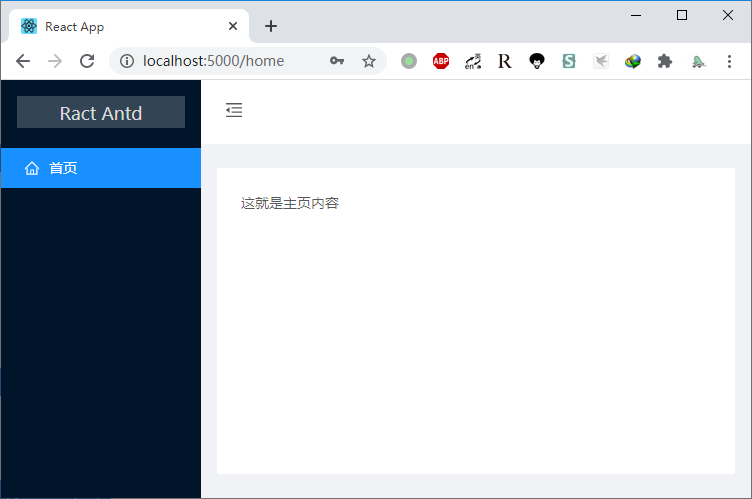
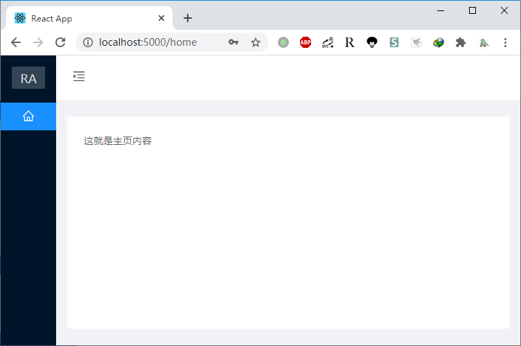

# React-antd-example

效果图

`login`





`home`





## 初始化项目

**创建项目**

> 使用 `react-creat-app` 脚手架创建使用`typescript`的项目

```
yarn create react-app react-antd-example --template typescript
```

**添加依赖**

> 使用 `antd` 和 `sass`

```
yarn add antd node-sass
```

> 使用 `React-Router` 路由

```
yarn add react-router-dom @types/react-router-dom
```

**指定端口**

> 默认端口 `3000`, 可通过 `cross-env PORT=5000` 指定端口

1. 安装 `cross-env`

```
yarn add cross-env
```

2. 修改 `package.json` 中的启动脚本 `scripts`

```json
{
  "scripts": {
    "start": "cross-env PORT=5000 react-scripts start",
    "build": "react-scripts build",
    "test": "react-scripts test",
    "eject": "react-scripts eject"
  }
}
```

## 体验 antd

参考文档 [https://ant.design/docs/react/use-in-typescript-cn](https://ant.design/docs/react/use-in-typescript-cn)

**按需导入**

> 使用  `babel-plugin-import` 插件实现按需导入

1. 自定义 `Create-React-App`，安装以下两个依赖

```
yarn add -D react-app-rewired customize-cra
```

2. 安装 `babel-plugin-import` 插件

```
yarn add babel-plugin-import
```

3. 在项目更目录创建 `config-overrides.js` 文件，启用 `.babelrc`

```javascript
const { useBabelRc, override } = require('customize-cra')

const config = override(useBabelRc())

module.exports = config
```

4. 修改 `package.json` 文件中的 `scripts`

```json
{
  "scripts": {
    "start": "cross-env PORT=5000 react-app-rewired start",
    "build": "react-app-rewired build",
    "test": "react-app-rewired test",
    "eject": "react-scripts eject"
  }
}
```

## 构建组件

**路由容器组件**

主页 `/home` 与 登录 `/login` 两个页面，默认跳转到登录页；登录成功后跳转主页

`App.tsx`

```typescript
import React from 'react';
import { BrowserRouter as Router, Route, Redirect } from 'react-router-dom';
import './App.css';

import { Home, Login } from './views'

const App: React.FC<{}> = (props) => {
  return (
    <div className="App">
      <Router>
        <Route path="/" >
          <Redirect to="/login" />
        </Route>
        <Route path="/home" exact component={Home} />
        <Route path="/login" exact component={Login} />
      </Router>
    </div>
  )
}

export default App;
```

**登录页组件**

用户名密码 `admin/admin123`

`Login.tsx`

```typescript
import React from 'react';

import { Form, Button, Input, message } from 'antd';
import { UserOutlined, LockOutlined } from '@ant-design/icons';

import '../styles/Login.scss';

const Login: React.FC<{history?: any}> = (props) => {

    const [form] = Form.useForm();

    const handleSumbit = (values: any) => {
        const {username, password} = values;
        if (username !== 'admin' || password !== 'admin123') {
            message.error('用户名或密码错误');
        } else {
            props.history?.push('/home');
        }
    }

    return (
        <div className="LoginPage">
            <Form
                name="basic"
                form={form}
                onFinish={handleSumbit}
            >
                <Form.Item
                    name="username"
                    rules={[{ required: true, message: '请输入用户名' }]}>
                    <Input prefix={<UserOutlined className="site-form-item-icon" />} placeholder="用户名" />
                </Form.Item>

                <Form.Item
                    name="password"
                    rules={[{ required: true, message: '请输入密码' }]}>
                    <Input
                        prefix={<LockOutlined className="site-form-item-icon" />}
                        type="password"
                        placeholder="登录密码" />
                </Form.Item>

                <Form.Item>
                    <Button type="primary" style={{ width: '100%' }} htmlType="submit">登录系统</Button>
                </Form.Item>
            </Form>
        </div>
    );
};

export default Login;
```

**首页组件**

内容呈现页面

`Home.tsx`

```typescript
import React, { useState } from 'react';
import { Layout, Menu } from 'antd';
import {
    MenuUnfoldOutlined,
    MenuFoldOutlined,
    HomeOutlined
} from '@ant-design/icons';

import '../styles/Home.scss';

const { Header, Sider, Content } = Layout;

const Home: React.FC<{}> = (props) => {

    const [collapsed, setCollapsed] = useState(false);

    const toggle = () => {
        setCollapsed(e => !e);
    };


    return (
        <div className="Home">
            <Layout style={{height: '100%'}}>
                <Sider trigger={null} collapsible collapsed={collapsed}>
                    <div className="logo">
                        <span>{collapsed ? "RA" : "Ract Antd"}</span>
                    </div>
                    <Menu theme="dark" mode="inline" defaultSelectedKeys={['1']}>
                        <Menu.Item key="1" icon={<HomeOutlined />}>
                            首页
                        </Menu.Item>
                    </Menu>
                </Sider>
                <Layout className="site-layout">
                    <Header className="site-layout-background" style={{ padding: 0 }}>
                        {React.createElement(collapsed ? MenuUnfoldOutlined : MenuFoldOutlined, {
                            className: 'trigger',
                            onClick: toggle,
                        })}
                    </Header>
                    <Content
                        className="site-layout-background"
                        style={{
                            margin: '24px 16px',
                            padding: 24,
                            minHeight: 280,
                        }}
                    >
                        这就是主页内容
                    </Content>
                </Layout>
            </Layout>
        </div>
    );

}

export default Home;
```